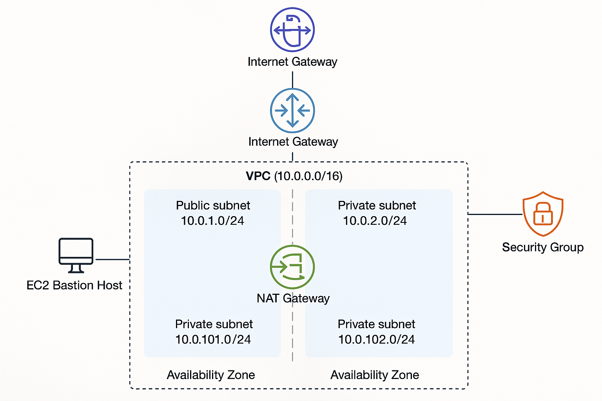

# 🌐 Terraform AWS VPC Project (Production-Ready)

This project provisions a **highly available and secure VPC architecture** using Terraform. It includes **public and private subnets across 2 Availability Zones**, a **NAT Gateway**, a **bastion EC2 instance**, and all necessary route tables and gateways.

> ✅ Ideal for learning production-level infrastructure setup on AWS using Terraform.

---

## 🚀 Features

- 🔐 Secure **VPC** with custom CIDR block
- 🌍 **Public & Private Subnets** in 2 AZs
- 🔄 **NAT Gateway** for outbound access from private subnets
- 🌐 **Internet Gateway** for public access
- 📦 Bastion **EC2 Instance** (Ubuntu 22.04) in public subnet
- 🛡️ Security Groups for SSH access
- 🧭 Proper **Route Table** configuration for all subnets

---

## 🧾 File Structure

```
vpc-project/
├── main.tf             # Main resources: VPC, subnets, EC2, NAT, IGW
├── variables.tf        # Input variable definitions
├── terraform.tfvars    # Actual values for the variables
├── outputs.tf          # Output values to expose after apply
├── provider.tf         # AWS provider configuration
└── README.md           # Project documentation
```

---

## ⚙️ Prerequisites

- ✅ [Terraform](https://developer.hashicorp.com/terraform/downloads) ≥ 1.6.0
- ✅ AWS CLI configured
- ✅ AWS account with permissions to provision VPC, EC2, NAT, etc.
- ✅ A configured AWS CLI named profile (e.g., `terraform-prod`)

---

## 📤 AWS Credentials

Make sure your AWS credentials are set using a named profile:

```bash
aws configure --profile terraform-prod
```

---

## 🚀 How to Use

### 1. Clone this Repository

```bash
git clone https://github.com/Aalyankhan/vpc-project.git
cd vpc-project
```

### 2. Initialize Terraform

```bash
terraform init
```

### 3. Validate the Configuration

```bash
terraform validate
```

### 4. Plan the Deployment

```bash
terraform plan
```

### 5. Apply the Configuration

```bash
terraform apply -auto-approve
```

---

## 📦 Outputs

After applying, Terraform will output:

- ✅ VPC ID
- ✅ Public Subnet IDs
- ✅ Private Subnet IDs
- ✅ EC2 Bastion Host Public IP

You can connect to the bastion host via SSH for admin tasks on private instances (future enhancement).

---

## 📚 Learnings and Concepts

This project demonstrates:

- ✅ Subnet design across multiple Availability Zones
- ✅ Public/private segregation using NAT and IGW
- ✅ EC2 provisioning and SSH access via security groups
- ✅ Clean code separation using `variables.tf` and `outputs.tf`
- ✅ Terraform best practices for production infrastructure

---

## 🧼 Cleanup

To tear down the infrastructure when you're done:

```bash
terraform destroy -auto-approve
```

---

## 🖼️ Architecture Diagram

This diagram shows the high-level design of the VPC with public/private subnets, NAT Gateway, and Bastion Host:



---

## 🪪 License

MIT License © 2025 [Aalyan Khan](https://github.com/Aalyankhan)

---

## 🤝 Contributing

Contributions, issues, and feature requests are welcome! Feel free to fork and submit a PR.
